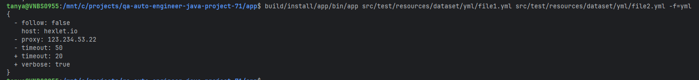
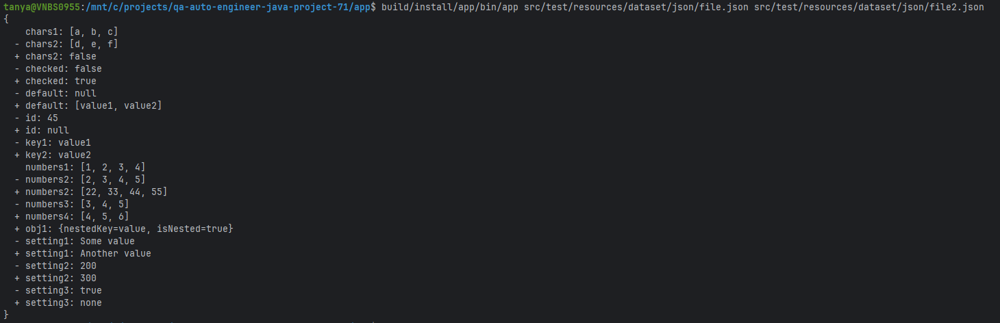
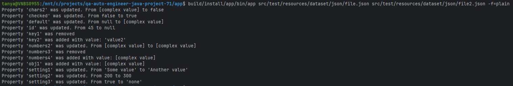
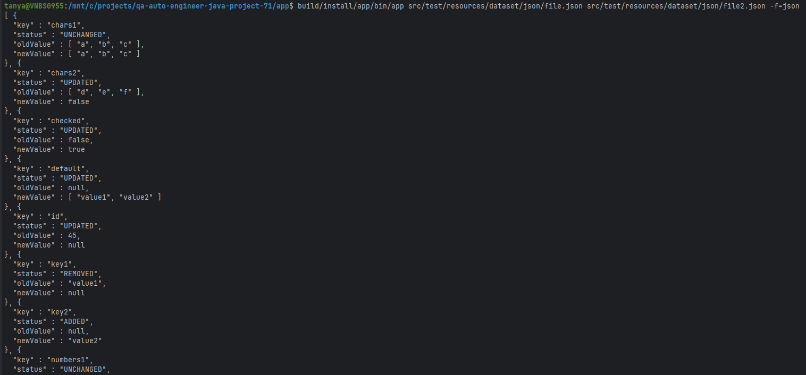

### Hexlet tests and linter status:
[](https://github.com/podolyak-tatyana/qa-auto-engineer-java-project-71/actions)

[](https://sonarcloud.io/summary/new_code?id=podolyak-tatyana_qa-auto-engineer-java-project-71)
[](https://sonarcloud.io/summary/new_code?id=podolyak-tatyana_qa-auto-engineer-java-project-71)
[](https://sonarcloud.io/summary/new_code?id=podolyak-tatyana_qa-auto-engineer-java-project-71)
[](https://sonarcloud.io/summary/new_code?id=podolyak-tatyana_qa-auto-engineer-java-project-71)


# Вычислитель отличий

## Описание проекта
Вычислитель отличий – консольная утилита для сравнения двух конфигурационных файлов и отображения различий между ними.

Поддерживаются форматы JSON и YAML (.yml, .yaml).
Результат сравнения может быть выведен в нескольких форматах: stylish, plain, json.
### Цель проекта
Проект реализован в учебных целях и демонстрирует работу с CLI, парсингом данных, построением внутреннего представления диффа и форматированием вывода.

### Возможности

1. сравнение двух файлов по ключам первого уровня

2. поддержка форматов входных данных:

- JSON

- YAML (yml, yaml)

3. поддержка форматов вывода:

- stylish — человекочитаемый формат (по умолчанию)

- plain — текстовое описание изменений

- json — машиночитаемый формат

4. корректная обработка:

- добавленных, удалённых и изменённых ключей

- null, boolean, чисел, строк

- массивов и объектов (без рекурсивного анализа)

### Тестирование и качество кода

- тесты написаны с использованием JUnit 5

- формат json тестируется через сравнение JSON-структур

- код проверяется линтером Checkstyle

- покрытие тестами собирается через JaCoCo

- CI настроен через GitHub Actions

### Makefile commands
```sh
make run-dist:
```
## задача 6 : сравнение плоских файлов (json)

## задача 7 : сравнение плоских файлов (yml)

## задача 9 : реализация stylish форматера 

## задача 10 : реализация plain форматера

## задача 11 : реализация json форматера
